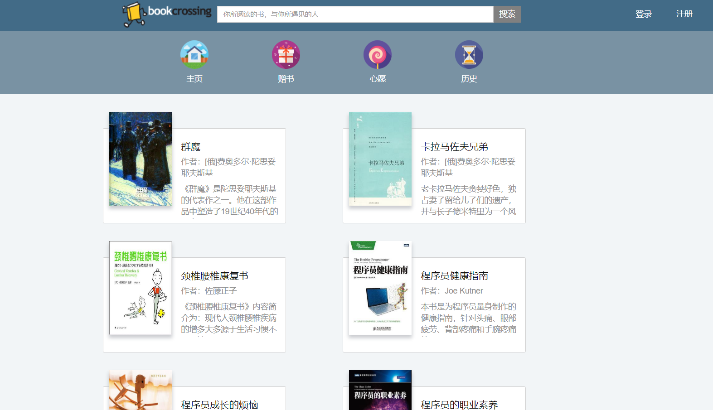
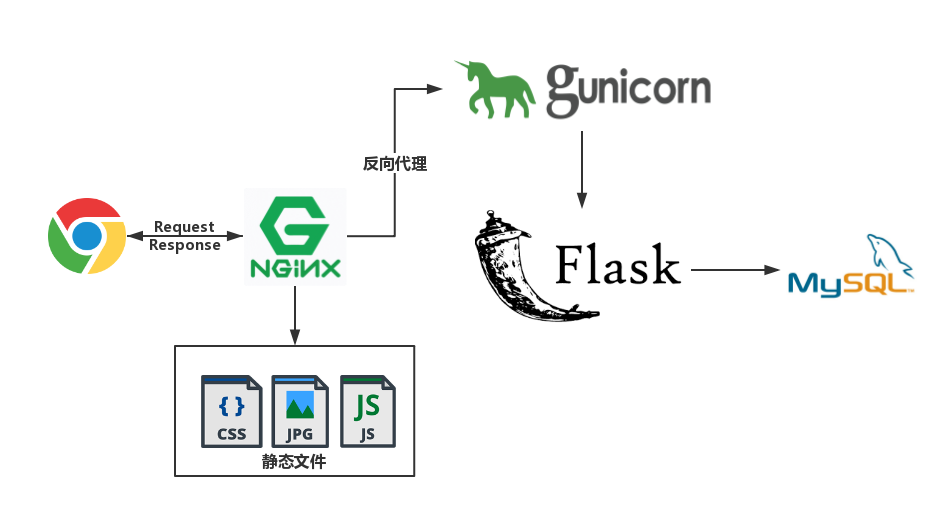
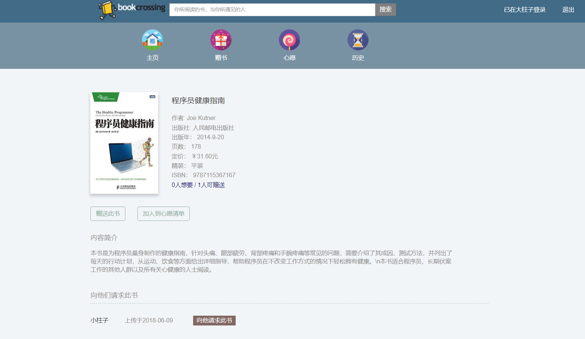
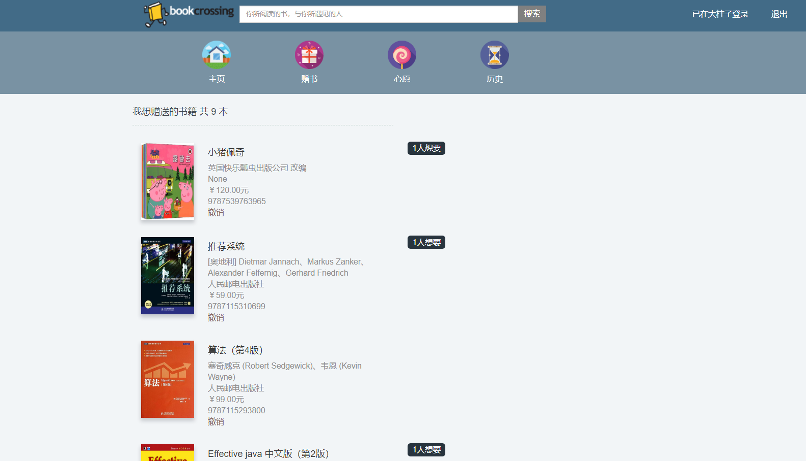
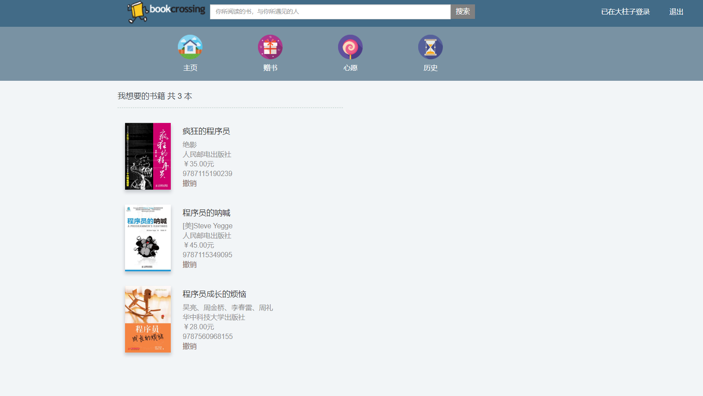
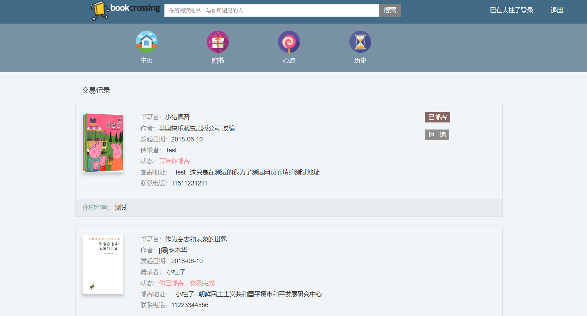
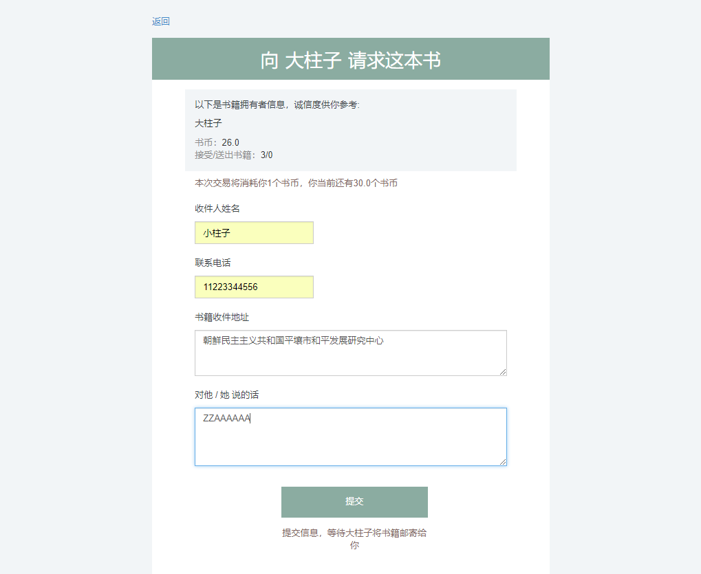
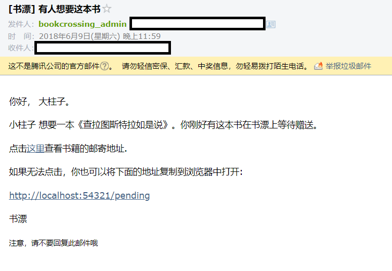

# 书漂网 - BookCrossing
[](https://travis-ci.org/mtianyan/hexoBlog-Github)
[](https://opensource.org/licenses/mit-license.php)

 


## 说明
书漂网是一个基于Flask搭建的书籍交换网站。主要功能如下：  

BookCrossing is a website based on flask for book exchange.The main functions are as follows:  

- [x] 用户注册登录(Registration/login)
- [x] 书籍搜索:基于豆瓣读书API(Search for books:Based on DouBan API)
- [x] 上传书籍(Upload books)
- [x] 赠送书籍(Send books)
- [x] 心愿书籍(Wish books)
- [x] 书籍交换:邮件通知(Exchange books:It will send you a eamil)
- [x] 密码找回:邮件通知(Retrieve password:It will send you a eamil)
- [x] 虚拟书币:用于书籍交换(Virtual book coins)
- [x] 对明文密码加密、加盐(Encrypt password:Salting)

## 依赖
* Python3.6.4
* Flask 1.0.2
* Flask-Login 0.4.1
* Flask-Mail 0.9.1
* Flask-SQLAlchemy 2.3.2
* Jinja2 2.10
* Werkzeug 0.14.1
* WTForms 2.2
* itsdangerous 0.24
* cymsql 0.9.10


## 服务器环境


## 文件组织
```
-- bookcrossing
    |-- Pipfile
    |-- Pipfile.lock
    |-- app
    |   |-- __init__.py
    |   |-- secure.py
    |   |-- setting.py
    |   |-- forms
    |   |-- libs
    |   |-- models
    |   |   |-- base.py
    |   |   |-- book.py
    |   |   |-- drift.py
    |   |   |-- gift.py
    |   |   |-- shupiao_book.py
    |   |   |-- user.py
    |   |   |-- wish.py
    |   |-- view_models
    |   |   |-- book.py
    |   |   |-- drift.py
    |   |   |-- gift.py
    |   |   |-- trade.py
    |   |   |-- user.py
    |   |   |-- wish.py
    |   |-- web
    |       |-- __init__.py
    |       |-- auth.py
    |       |-- book.py
    |       |-- drift.py
    |       |-- gift.py
    |       |-- main.py
    |       |-- wish.py
    |   |-- static
    |   |-- templates
    |-- test
    |-- run.py
```

##  展示
#### 书籍详情

#### 赠送书籍 

#### 心愿书籍

#### 交易历史 

#### 交换请求

#### 邮件通知



